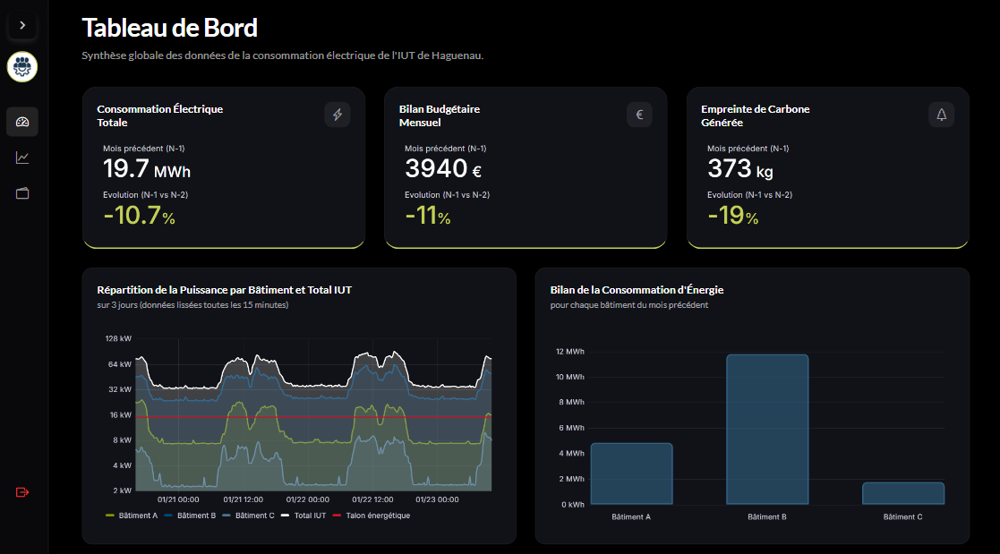

# Dashboard Grafana - Consommation Énergétique IUT Haguenau

Tableau de bord pour le suivi de la consommation énergétique de l'IUT d'Haguenau.

## 📖 Présentation

Ce projet permet de visualiser et suivre en temps réel la consommation énergétique de différents bâtiments de l'IUT de Haguenau. Le système collecte les données via des compteurs IoT et les affiche sur un tableau de bord Grafana intuitif. 
Le dashboard est une application web basée sur Symfony, conçue pour suivre, visualiser et analyser les données de consommation énergétique. L'application utilise une architecture à double base de données : MySQL est utilisé pour la gestion et l'authentification des utilisateurs, tandis qu'InfluxDB (via Grafana) gère les données énergétiques en temps réel à haut volume. 

### Objectifs du projet

- Surveiller la consommation électrique totale
- Analyser le bilan budgétaire mensuel
- Calculer l'empreinte carbone générée
- Comparer la consommation entre différents bâtiments
- Visualiser les données de puissance en temps réel

## 🏗️ Architecture du Projet

Le projet utilise les technologies suivantes :

- **Node-RED** : Collecte et traitement des données des capteurs
- **InfluxDB** : Base de données de séries temporelles
- **Grafana** : Visualisation des données

### Schéma d'architecture

1. Les compteurs IoT collectent les données de consommation
2. Node-RED récupère et transforme ces données
3. Les données sont stockées dans InfluxDB
4. Grafana interroge InfluxDB pour afficher les visualisations

### Technologies utilisées

- Node-RED
- InfluxDB 2.x
- Grafana 10.x
- Symfony
- MySQL

## 👥 Développeurs

<a href="https://github.com/melindaland" target="_blank" class="credit-name">**ALAND Mélinda**</a>, 
<a href="https://baslan67.github.io/portfolio/" target="_blank" class="credit-name">**ASLAN Baran**</a> et 
<a href="https://github.com/celico7" target="_blank" class="credit-name">**HOFFMANN Célia**</a> - 2026

Projet SAE501 - IUT de Haguenau
